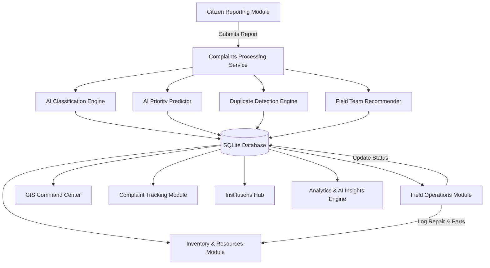
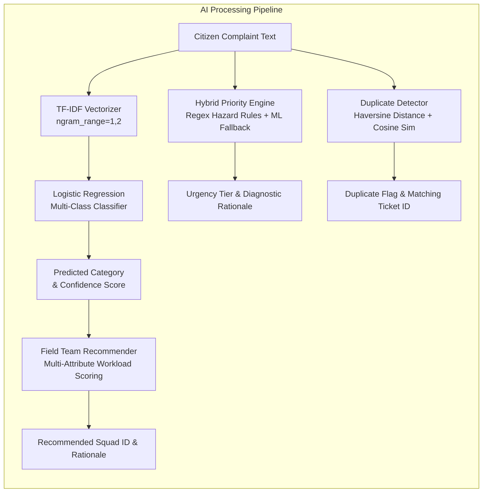
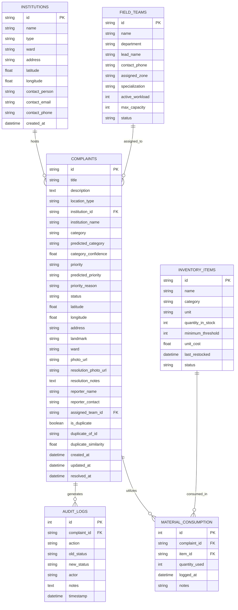
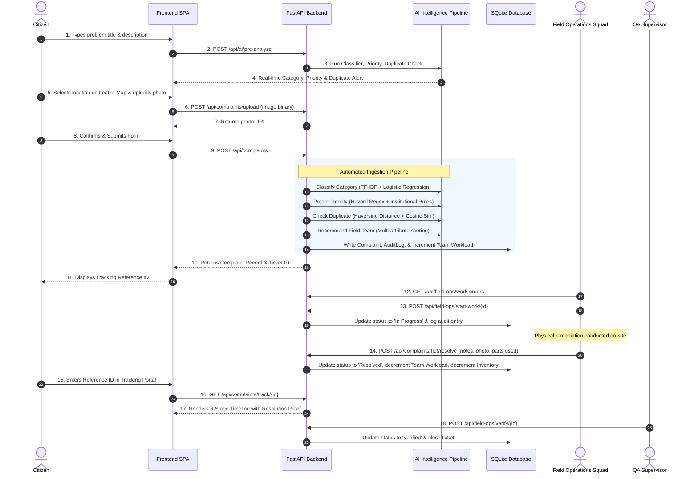

# CivicAI — AI-Powered Crowdsourced Civic Issue Reporting and Resolution Platform
## Academic Project Documentation & Technical Specification

---

# 1. TITLE PAGE

```
========================================================================================
                                     PROJECT REPORT
                                           ON
                                        CivicAI
          AI-Powered Crowdsourced Civic Issue Reporting and Resolution Platform

                     Bachelor of Technology (B.Tech) Degree
                 Computer Science & Engineering / AI & Data Science
========================================================================================

Project Title:
CivicAI — AI-Powered Crowdsourced Civic Issue Reporting and Resolution Platform

Platform Classification:
Civic Technology Operating System & Municipal Field Operations Management

Academic Context:
Final Year Project / Capstone Project Documentation & Technical Evaluation Record

Target Audience:
Project Evaluation Committee, Head of Department (HOD), Project Guides, 
Technical Reviewers, and Hackathon Evaluation Panels

Core Focus Areas:
Applied Machine Learning (Scikit-Learn), Geospatial Information Systems (GIS),
Asynchronous Web APIs (FastAPI), Relational Persistence (SQLAlchemy/SQLite),
and Citizen-to-Field Operational Workflows.

Project Status:
Fully Functional Working Prototype (Backend, Active AI Pipeline, Single-Page Web Portal)
========================================================================================
```

> **Note on Authorship & Academic Registry**: This document represents the technical project specification and architectural documentation for the CivicAI platform. Student names, institutional affiliations, department details, guide credentials, and university registration numbers are left to be configured in accordance with the submitting candidate's academic institution guidelines.

---

# 2. ABSTRACT

Modern urban environments and educational/corporate institutions face continuous infrastructural degradation, ranging from road hazards and malfunctioning streetlights to sanitation bottlenecks and electrical faults. Traditional civic grievance mechanisms suffer from fragmented communication channels, manual ticket triage, lack of automated prioritization, duplicate complaint influx, and disconnected field operations. 

**CivicAI** is an AI-powered, crowdsourced civic issue reporting and resolution platform engineered to bridge the operational divide between citizens, institutional facility managers, municipal authorities, and field remediation squads. The platform provides a unified digital portal supporting thirteen distinct civic and institutional categories, including Roads & Potholes, Garbage & Waste, Drainage & Sewage, Water Supply, Electrical Infrastructure, Streetlights, Public Infrastructure, Traffic & Road Signs, Parks & Public Spaces, School Issues, College Issues, Office/Workplace Issues, and Public Sanitation.

Citizens can submit geo-tagged complaints accompanied by detailed descriptions, street addresses, municipal ward assignments, landmark markers, and photographic evidence. The backend is powered by a multi-stage machine learning and algorithmic intelligence pipeline implemented using Python and Scikit-Learn:
1. **Issue Classification**: A TF-IDF vectorizer coupled with a multinomial Logistic Regression classifier automatically categorizes citizen reports and provides statistical prediction confidence.
2. **Risk-Weighted Priority Prediction**: A hybrid engine combining deterministic safety keyword extraction (scanning for hazards such as live wires, gas leaks, and road cave-ins), institutional vulnerability elevation (escalating risks within schools, universities, and hospitals), and machine learning inference estimates urgency (Critical, High, Medium, Low).
3. **Spatial & Textual Duplicate Detection**: A dual-stage filter utilizing Haversine great-circle distance computation and TF-IDF cosine text similarity identifies redundant or proximate complaints, mitigating dispatch congestion while consolidating civic urgency.
4. **Workload-Balanced Field Team Recommendation**: A heuristic multi-attribute ranking algorithm evaluates department specialization, geographic ward coverage, institutional bonus weighting, and real-time team workload capacity to recommend appropriate field squads.

The platform provides an integrated operational ecosystem featuring:
- A progressive six-milestone citizen complaint tracking docket (`Submitted` &rarr; `AI Analyzed` &rarr; `Assigned` &rarr; `In Progress` &rarr; `Resolved` &rarr; `Verified`).
- An interactive GIS Command Center built with Leaflet.js and OpenStreetMap displaying spatial markers, institutional campuses, and automated ward density hotspot severity clusters.
- A dedicated Field Operations Console allowing crews to claim work orders, transition job states, upload completion photographic proof, and log spare parts and material consumption directly against a municipal inventory repository.
- An Executive AI Analytics Dashboard visualizing key performance indicators (KPIs), resolution velocity, ward risk distributions, and actionable municipal advisories.

CivicAI operates as a complete, functioning prototype implemented using FastAPI, SQLAlchemy, SQLite, Scikit-Learn, and Vanilla HTML5/CSS3/JavaScript, establishing a scalable foundation for modern, transparent urban governance.

---

# 3. INTRODUCTION

Urban management and civic maintenance are among the most critical functions of local governments, municipal corporations, and large educational or corporate campuses. The rapid pace of urbanization, combined with aging physical infrastructure, places unprecedented strain on public works departments, electrical supply boards, sanitation agencies, and water supply authorities. 

Historically, civic maintenance has operated in reactive, departmental silos:
- Citizens encounter broken civic assets (e.g., collapsed storm drains, open manholes, or street blackouts) but lack a transparent, unified digital medium to lodge actionable complaints.
- Municipal departments maintain separate toll-free helplines, paper registers, or basic web portals that simply store raw text complaints without automated understanding.
- Field maintenance crews are dispatched based on arbitrary scheduling rather than real-time severity assessment or geographic clustering.
- Citizens remain uninformed regarding the progress of their complaints, breeding public dissatisfaction and leading to repetitive complaints for the exact same physical failure.

The advent of accessible machine learning, lightweight geospatial visualization libraries, and high-performance asynchronous web frameworks creates an opportunity to rethink civic issue reporting. By transforming unstructured natural-language reports into structured, categorized, prioritized, and spatially mapped work orders, municipal administrations can dramatically reduce mean-time-to-resolution (MTTR), balance technician workloads, and improve civic asset lifecycles.

**CivicAI** addresses this challenge by delivering a centralized, AI-assisted platform that serves the complete lifecycle of a civic issue—from initial citizen discovery and real-time AI triage to field squad assignment, spare-parts inventory deduction, supervisor verification, and spatial intelligence visualization.

---

# 4. PROBLEM STATEMENT

Urban civic grievance management systems currently exhibit severe systemic bottlenecks that hinder timely remediation:

1. **Fragmented Reporting Channels**: Citizens are required to identify which specific municipal department manages an issue (e.g., determining whether water overflowing onto a road is an issue for the Roads Department, the Water Supply and Sewerage Board, or the Stormwater Drainage Division).
2. **Manual Ticket Triage Bottlenecks**: Administrative personnel must manually read, interpret, categorize, and route hundreds of complaints daily, resulting in significant administrative latency and frequent misrouting.
3. **Absence of Hazard-Aware Urgency Assessment**: Critical life-safety threats (e.g., snapped high-tension electrical cables near a kindergarten or hospital ambulance bay drainage collapses) are queued in first-in, first-out (FIFO) sequences alongside routine cosmetic issues (e.g., faded paint on a park bench).
4. **Duplicate Ticket Overload**: When an infrastructure failure occurs in a high-density public area (such as a large pothole at a major traffic junction), dozens of citizens submit independent reports. Traditional systems treat each as an isolated job, causing administrative confusion, redundant inspections, and skewed reporting metrics.
5. **Disconnected Field & Resource Operations**: Field crews lack a unified digital workflow to receive work orders, log physical repair steps, provide photographic evidence of completed work, and account for municipal spare parts (e.g., asphalt bags, LED luminaires, or PVC pipes) consumed during the repair.
6. **Lack of Geospatial and Predictive Insights**: Municipal decision-makers lack centralized GIS heatmaps and automated analytics to identify chronic failure hotspots, assess contractor/squad capacity bottlenecks, and plan proactive preventative maintenance.

CivicAI formulates a solution by introducing an automated, intelligence-augmented platform that processes natural language, geographic coordinates, and operational constraints into structured municipal actions.

---

# 5. EXISTING SYSTEM

Traditional and contemporary municipal complaint-handling mechanisms typically rely on decentralized physical desks, call centers, or first-generation web portals.

### 5.1 Characteristics of the Existing System
- **Manual Data Entry & Physical Registers**: Citizens visit municipal ward offices or lodge complaints via phone helplines where operators manually type notes into basic databases.
- **Departmental Segregation**: Independent departments (e.g., Roads, Electricity, Waste, Water, Health) operate independent systems with no cross-departmental data sharing.
- **Unstructured Text Processing**: Existing complaint software stores complaints as arbitrary freeform strings without automated natural language processing (NLP) to detect intent, category, or urgency.
- **Manual Dispatch**: Supervisors must manually scan open rosters, guess technician availability, and phone field crews without knowledge of real-time workload saturation.
- **Opaque Citizen Feedback**: Once submitted, citizens receive at best a static tracking SMS with no visibility into intermediate stages such as on-site investigation, spare parts acquisition, or repair completion.

### 5.2 Limitations of the Existing System

| Operational Dimension | Traditional / Existing System | Implication |
| :--- | :--- | :--- |
| **Intake Mechanism** | Fragmented phone lines, physical counters, basic static web forms | High barrier to entry; citizen friction |
| **Categorization** | Manual selection by citizen or clerical operator | High error rate; cross-departmental ping-pong |
| **Urgency Detection** | Static priority or manual triage | Critical safety hazards delayed behind routine tickets |
| **Duplicate Handling** | None; every submission generates a new ticket | Dispatch confusion; wasted field squad travel |
| **Geographic Context** | Textual landmark descriptions (e.g., "near temple") | Technicians waste time locating physical failure points |
| **Workload Balancing** | Manual assignment without capacity tracking | Squad burnout; unbalanced technician queues |
| **Material Tracking** | Disconnected paper slips or unrecorded warehouse stock | Inventory leakage; unaccounted repair costs |
| **Quality Verification** | Verbal closure or unverified checkbox | Unresolved or sub-standard repairs marked as closed |

---

# 6. PROPOSED SYSTEM

CivicAI replaces fragmented workflows with an integrated, intelligent, and transparent civic operations platform. 

### 6.1 Architectural Concept
CivicAI establishes a single unified portal serving four key stakeholder groups:
1. **Citizens & Campus Users**: Report issues with rich location data and photographic evidence; receive instant AI feedback and real-time progressive tracking.
2. **Municipal Administrators & Facility Managers**: Review incoming dockets, verify AI recommendations, monitor ward-level risk clusters, and analyze operational trends.
3. **Field Operations Squads**: Access assigned work orders, update status to on-site execution, record repair notes, attach proof photos, and deduct replacement parts from inventory.
4. **Executive Decision Makers**: Monitor macro-level resolution velocities, SLA compliance rates, and spatial density heatmaps.

### 6.2 Key Architectural Innovations
- **Interactive Pre-Analysis at Intake**: As a citizen types an issue description, debounced API calls trigger real-time AI classification and priority scoring in the reporting form, guiding users and alerting them to duplicate issues before submission.
- **Hybrid Machine Learning & Deterministic Risk Triage**: Combining the statistical generalization of TF-IDF Logistic Regression with deterministic regex hazard rules ensures that critical safety threats are guaranteed high-priority routing.
- **Spatial-Textual Duplicate Clustering**: Integrating Haversine geographic radius filtering with cosine textual similarity identifies whether a new report refers to an existing active issue within 150m–500m.
- **Closed-Loop Field Resolution & Inventory Integration**: Linking complaint resolution to municipal spare-parts consumption ensures accurate operational accounting and automated inventory threshold alerts (Low Stock, Critical Reorder).

---

# 7. OBJECTIVES

The primary engineering and functional objectives of the CivicAI platform are:

1. **Provide an Intuitive Digital Intake Interface**: Deliver a guided 4-step reporting wizard enabling citizens to submit title, description, category, environment type, interactive Leaflet GPS pin-drop, address, landmarks, and photographic evidence.
2. **Automate Civic Issue Classification**: Implement a natural language processing model using TF-IDF n-gram feature extraction and Logistic Regression to categorize reports across 13 civic categories with calibrated statistical confidence.
3. **Establish Multi-Tier Risk-Weighted Prioritization**: Develop a priority prediction engine that scans for immediate public safety hazards, elevates institutional vulnerabilities (schools, colleges, hospitals), and falls back on trained machine learning models.
4. **Mitigate Redundant Dispatches via Duplicate Detection**: Construct a spatial-textual duplicate detector that filters open tickets by geographic proximity (Haversine distance) and evaluates textual similarity (cosine similarity).
5. **Optimize Field Squad Dispatching**: Design a multi-attribute recommendation algorithm that matches issue category to department squads, rewards institutional specialization, respects municipal zones, and penalizes overloaded squads.
6. **Enable Transparent Progressive Tracking**: Provide citizens with a 6-milestone tracking pipeline (`Submitted` &rarr; `AI Analyzed` &rarr; `Assigned` &rarr; `In Progress` &rarr; `Resolved` &rarr; `Verified`) detailing assigned teams, lead contacts, and complete timestamped audit logs.
7. **Digitize Field Operations & Work Orders**: Enable field squads to view active work orders, mark commencement of on-site work (`In Progress`), upload photographic resolution proof, and log comprehensive resolution notes.
8. **Integrate Municipal Inventory & Spare-Parts Management**: Maintain a live inventory of repair materials, track physical consumption per complaint, and support restocking workflows.
9. **Deliver GIS Spatial Geo-Intelligence**: Build an interactive Leaflet map rendering geo-tagged issue pins, institutional facilities, and dynamically computed ward density hotspot clusters.
10. **Generate Executive AI Analytics & Operational Insights**: Compute real-time municipal health metrics, resolution rates, average SLA turnaround hours, ward risk rankings, and automated actionable advisories.

---

# 8. SCOPE OF THE PROJECT

The scope of CivicAI spans civic infrastructure in public municipal domains as well as structured institutional campus environments.

### 8.1 Functional Scope by User Domain

```
+----------------------------------------------------------------------------------------------------+
|                                         CIVICAI PLATFORM SCOPE                                     |
+-----------------------------------+----------------------------------+-----------------------------+
| 1. CITIZEN & COMMUNITY DOMAIN     | 2. MUNICIPAL & OPERATIONAL DOMAIN| 3. INSTITUTIONAL FACILITIES |
| • Public Road Cratering & Potholes| • Automated AI Complaint Intake  | • Engineering Colleges      |
| • Streetlight Outages & Failures  | • Capacity-Aware Team Dispatch   | • Senior Secondary Schools  |
| • Sewage Overflow & Manhole Voids | • Work Order Progress Monitoring | • Multispecialty Hospitals  |
| • Water Main Ruptures & Supply    | • Spare Parts Stock Restocking   | • Technology & IT Parks     |
| • Garbage Dumps & Sanitation      | • Ward Hotspot Density Risk Maps | • Transit Terminals         |
| • Park Equipment & Hazard Trees   | • Real-Time Municipal Analytics  | • Dedicated Campus Squads   |
+-----------------------------------+----------------------------------+-----------------------------+
```

### 8.2 Operational Boundaries & Delimitations
- **Implemented Scope**: The current system is a fully functioning prototype featuring a complete FastAPI backend, five Scikit-Learn AI modules, an interactive SPA frontend, an SQLite relational database, local multipart file upload handling, and an automated Pytest test suite.
- **Boundaries (Delimitations)**:
  - The database utilizes SQLite for self-contained, zero-configuration local deployment rather than a distributed cloud DBMS (e.g., PostgreSQL).
  - Photographic evidence is uploaded and stored locally in the backend static directory (`backend/static/uploads/`) rather than an external object storage service (e.g., AWS S3).
  - Machine learning models process natural language text descriptions; uploaded images are stored and rendered as visual evidence rather than processed through deep computer vision models.
  - Role management is partitioned logically across dedicated application views rather than secured through JSON Web Tokens (JWT) or OAuth2 identity providers.

---

# 9. KEY FEATURES

The features documented below represent verified, active capabilities implemented in the codebase:

- **Guided 4-Step Citizen Reporting Wizard**:
  - *Step 1 (Details & AI)*: Title, description, category selector, location-type context, and real-time interactive AI pre-analysis.
  - *Step 2 (Location)*: Interactive Leaflet map with drag-and-drop pin placement, reverse-coordinate capture, ward selection, text address, landmark, and a 30+ institutional preset directory.
  - *Step 3 (Evidence & Contact)*: File upload with instant client-side preview, reporter name, and phone contact.
  - *Step 4 (Review & Submit)*: Form summary card, automated duplicate warning alert with match similarity percentage, and ticket generation.
- **Real-Time Interactive AI Pre-Analysis**: Debounced API calls query the backend as the user inputs details, instantly returning predicted category, confidence score, priority level, diagnostic rationale, and potential duplicate warnings.
- **Automated AI Intelligence Pipeline on Ingestion**: Every complaint submitted automatically triggers Scikit-Learn classification, hybrid priority determination, duplicate checking, team assignment, and audit log generation within a single database transaction.
- **Citizen Milestone Tracking Docket**: Lookup by unique alphanumeric reference ID (e.g., `CIVIC-2026-1001`), rendering a 6-stage visual milestone pipeline with color-coded badges, assigned squad contact information, and timestamped audit events.
- **GIS Command Center**: Interactive OpenStreetMap interface featuring:
  - Priority-coded marker pins (Critical = Coral, High = Amber, Medium = Blue, Low = Slate).
  - Institutional campus layer with facility metadata.
  - Dynamically computed ward hotspot circles with proportional radiuses and severity indices.
  - Multi-attribute filter controls (Category, Priority, Status, Ward).
- **Institutional Management Hub**: Directory of registered campuses (Universities, Schools, Hospitals, Tech Parks) displaying live metrics for total, open, in-progress, resolved, and critical complaints, with a deep-dive complaint docket modal.
- **Field Operations Console**:
  - Real-time squad workload indicators displaying active load against maximum capacity (e.g., `4/10 Active`) with color-coded progress meters.
  - Filterable work order list with status transition actions (`Start Field Work` &rarr; moves to `In Progress`).
  - Interactive Resolution Modal capturing field notes, proof photos, and material consumption.
- **Municipal Spare-Parts Inventory Hub**:
  - Asset inventory tracking quantity on hand, minimum safety thresholds, unit costs, and automated stock health badges (`In Stock`, `Low Stock`, `Critical Reorder`).
  - Restocking modal to increment stock quantities.
  - Live consumption audit log tracking which materials were applied to which specific ticket ID.
- **Executive AI Analytics & Command Dashboard**:
  - Top-line KPIs: Total Complaints, Critical Issues, Open Queue, In Progress, Resolved Count, Resolution Rate (%), and Average SLA Turnaround Hours.
  - Dynamic CSS bar charts for category distributions and priority shares.
  - Ward Hotspot Risk Table sorting municipal divisions by composite risk score.
  - Actionable AI Advisories providing automated operational recommendations based on active data patterns.
  - Filterable global complaint registry table.

---

# 10. SYSTEM MODULES



### 10.1 Citizen Reporting Module
- **Purpose**: Provides a guided, user-friendly interface for citizens and campus members to document and lodge civic grievances.
- **Input**: Issue title, natural-language description, environment type (Public, College, School, Hospital, Workplace, Municipal Facility), Leaflet map latitude/longitude, physical address, landmark, ward, photographic image file, and reporter contact.
- **Processing**: Executes client-side validation; triggers debounced real-time pre-analysis against `/api/ai/pre-analyze`; uploads image binary via `/api/complaints/upload`; issues payload to `POST /api/complaints`.
- **Output**: Unique reference ID (`CIVIC-YYYY-XXXX`), initial status assignment (`Submitted` or `AI Analyzed` or `Assigned`), and success confirmation modal.
- **Interactions**: Interfaces with AI Pipeline, Complaints API, Storage Service, and GIS Map component.

### 10.2 Complaint Tracking Module
- **Purpose**: Offers transparent, self-service tracking for citizens without requiring authenticated account login.
- **Input**: Alphanumeric Complaint Reference ID.
- **Processing**: Queries `GET /api/complaints/track/{id}`; calculates index in the progressive milestone sequence; joins assigned `FieldTeam` metadata; retrieves all corresponding `AuditLog` rows.
- **Output**: Interactive timeline UI displaying completion state for 6 stages, assigned team lead and phone contact, issue image, resolution proof image, and chronological audit trail.
- **Interactions**: Reads from `complaints`, `field_teams`, and `audit_logs` database tables.

### 10.3 GIS Command Center & Spatial Geo-Intelligence
- **Purpose**: Centralizes spatial visualization of civic issues, registered institutions, and geographic clusters.
- **Input**: Filter parameters (category, priority, status, ward) from UI controls.
- **Processing**: Queries `GET /api/gis/map-data`; backend filters active records; computes ward-level centroid coordinates and aggregates severity indices (`Severity = (Critical × 3) + (High × 2) + Count`); returns structured GeoJSON-like payload.
- **Output**: Interactive Leaflet map rendering custom color-coded circle markers for complaints, building icons for institutions, and semi-transparent radial circles for ward hotspots.
- **Interactions**: Interacts with OpenStreetMap tile servers, `complaints` table, and `institutions` table.

### 10.4 AI Issue Classification Module
- **Purpose**: Eliminates manual triage by predicting the appropriate civic category from unstructured report text.
- **Input**: Concatenated string of complaint title and description.
- **Processing**: Vectorized using Scikit-Learn `TfidfVectorizer` (sublinear term frequency, unigrams + bigrams); classified via `LogisticRegression` (balanced class weighting); probability calibrated using `predict_proba`.
- **Output**: Predicted category name (e.g., `Roads & Potholes`) and floating-point confidence score (e.g., `0.942`).
- **Interactions**: Invoked during pre-analysis and complaint creation; updates `predicted_category` and `category_confidence`.

### 10.5 AI Priority & Severity Assessment Module
- **Purpose**: Establishes triage urgency to ensure hazardous conditions receive immediate attention.
- **Input**: Complaint text, category, and location type.
- **Processing**:
  1. Scans for critical safety regex patterns (`live wire`, `sparking`, `gas leak`, `deep crater`, `cave-in`, `open manhole`, `toxic`, etc.).
  2. Evaluates institutional sensitivity: if location is a School, College, or Hospital and category involves Electrical, Sanitation, or Drainage, urgency is elevated to `Critical`.
  3. Scans for high operational disruption patterns (`flooding`, `no water`, `dark`, `choked`).
  4. Falls back to a Scikit-Learn TF-IDF Logistic Regression priority classifier.
- **Output**: Priority tier (`Critical`, `High`, `Medium`, `Low`) and human-readable diagnostic explanation string.
- **Interactions**: Sets `priority`, `predicted_priority`, and `priority_reason` fields in `Complaint`.

### 10.6 Duplicate & Related Complaint Detection Module
- **Purpose**: Identifies whether an incoming complaint refers to an already reported active civic failure.
- **Input**: New report title, description, latitude, longitude, category, institution ID, and active open complaints list.
- **Processing**:
  1. Computes great-circle distance using Haversine formula against all open complaints.
  2. Pre-selects candidates within 500 meters, candidates sharing the same institution ID, or candidates matching category.
  3. Builds TF-IDF unigram/bigram feature space across candidate texts and calculates pairwise Cosine Similarity.
  4. Applies tiered heuristics:
     - Same institution + similarity $\ge 0.50$ &rarr; Duplicate.
     - Distance $\le 150\text{m}$ + similarity $\ge 0.40$ &rarr; Duplicate.
     - Distance $\le 300\text{m}$ + category match + similarity $\ge 0.50$ &rarr; Duplicate.
     - Text similarity $\ge 0.85$ (regardless of distance) &rarr; Duplicate.
- **Output**: Boolean `is_duplicate`, matched `duplicate_of_id`, float `duplicate_similarity`, and diagnostic explanation.
- **Interactions**: Updates duplicate flags in `Complaint`; creates explanatory audit record.

### 10.7 Field Team Recommendation & Dispatch Module
- **Purpose**: Recommends and assigns the most suitable field squad while balancing active departmental workloads.
- **Input**: Issue category, location type, ward, and list of registered `FieldTeam` records.
- **Processing**: Evaluates a multi-attribute scoring model:
  $$\text{Score} = S_{\text{dept}} + S_{\text{inst}} + S_{\text{zone}} + S_{\text{capacity}} - P_{\text{overload}} - P_{\text{status}}$$
  - Primary department match: $+50$ points.
  - Institutional facility keyword match: $+25$ points.
  - Geographic zone/ward match: $+20$ points.
  - Workload availability bonus: $(1.0 - \text{load\_ratio}) \times 25$ points.
  - Over-capacity penalty: $-40$ points if `active_workload >= max_capacity`.
- **Output**: Selected team ID, team name, and recommendation rationale.
- **Interactions**: Sets `assigned_team_id`, increments squad `active_workload`, updates complaint status to `Assigned`.

### 10.8 Field Operations & Work Order Module
- **Purpose**: Serves as the operational portal for maintenance crews executing repairs on the ground.
- **Input**: Team ID filter, work order actions (`start-work`, `resolve`, `assign`).
- **Processing**:
  - `POST /api/field-ops/start-work/{id}` updates status to `In Progress` and logs arrival.
  - `POST /api/complaints/{id}/resolve` accepts resolution notes, proof photo URL, decrements team workload, and triggers material consumption records.
  - `POST /api/field-ops/verify/{id}` marks ticket as `Verified` and closes docket.
- **Output**: Updated complaint model, adjusted squad workload counters, and timestamped audit logs.
- **Interactions**: Mutates `Complaint`, `FieldTeam`, `InventoryItem`, `MaterialConsumption`, and `AuditLog` tables.

### 10.9 Resources & Spare Parts Inventory Module
- **Purpose**: Maintains operational accounting of municipal hardware, materials, and spare parts.
- **Input**: Item category/status filters, restock quantities, or consumption payloads.
- **Processing**:
  - Deducts `quantity_used` during work order resolution.
  - Evaluates remaining stock against `minimum_threshold`; automatically shifts item status (`In Stock`, `Low Stock`, `Critical Reorder`).
  - Supports manual restock calls via `POST /api/inventory/{id}/restock`.
- **Output**: Live inventory roster, stock health status, and historical consumption log.
- **Interactions**: Relates `MaterialConsumption` to `Complaint` and `InventoryItem`.

### 10.10 Institutions & Campuses Facility Module
- **Purpose**: Provides specialized civic maintenance tracking for large closed campuses (Universities, Schools, Hospitals, Tech Parks).
- **Input**: Facility type filter, institution ID.
- **Processing**: Computes aggregated complaint metrics per institution (Total, Open, In Progress, Resolved, Critical); retrieves all associated complaints in reverse-chronological order.
- **Output**: Institution cards with live metric counters and full complaint modal.
- **Interactions**: Queries `institutions` table with foreign key joins on `complaints.institution_id`.

### 10.11 Analytics & AI Insights Engine
- **Purpose**: Generates high-level statistical intelligence, performance benchmarks, and automated advisories for municipal leadership.
- **Input**: Complete historical complaint records and institutional roster.
- **Processing**:
  - Computes counts, resolution rate percentage, and mean turnaround hours from `created_at` to `resolved_at`.
  - Aggregates ward-level risk severity scores:
    $$\text{Risk Score} = (N_{\text{Critical}} \times 3.5) + (N_{\text{High}} \times 2.0) + (N_{\text{Medium}} \times 1.0)$$
  - Identifies top frequency categories and institutional vulnerability patterns.
  - Formulates structured advisory objects (`hotspot_alert`, `category_trend`, `campus_safety`, `efficiency_kpi`).
- **Output**: JSON payload consumed by the Executive Dashboard and Home hero statistics.
- **Interactions**: Computes dynamically across the `complaints` repository via `/api/ai/insights`.

### 10.12 Evidence & Photographic Upload Service
- **Purpose**: Handles binary image ingestion for complaint documentation and repair verification.
- **Input**: `multipart/form-data` file stream sent to `/api/complaints/upload`.
- **Processing**: Generates unique timestamped filename with pseudo-random seed (`photo_YYYYMMDDHHMMSS_XXX.ext`); streams binary to `backend/static/uploads/`; verifies directory persistence.
- **Output**: Relative public asset URL (e.g., `/static/uploads/photo_20260921153012_482.jpg`).
- **Interactions**: File system I/O, referenced by `Complaint.photo_url` and `Complaint.resolution_photo_url`.

### 10.13 Complaint Audit History & Lifecycle Logging
- **Purpose**: Guarantees complete non-repudiation and traceability of every operational action taken on a ticket.
- **Input**: Complaint ID, action description, previous status, new status, actor name, and descriptive notes.
- **Processing**: Created on complaint creation, AI processing, team dispatch, field arrival, resolution, and verification; persists to `audit_logs` table.
- **Output**: Chronological event stream returned during complaint tracking and administrative audits.
- **Interactions**: Foreign-keyed to `Complaint.id`.

---

# 11. ARTIFICIAL INTELLIGENCE AND MACHINE LEARNING

CivicAI incorporates applied Machine Learning (ML) and deterministic Natural Language Processing (NLP) models.

> **Academic Rigor & Terminology Clarification**: CivicAI **does not** utilize black-box deep learning, Large Language Models (LLMs), Generative AI, or Convolutional Neural Networks (CNNs). All machine learning capabilities are implemented using classical, mathematically grounded algorithms from the Python **Scikit-Learn** library, chosen for their deterministic execution, rapid CPU inference (<5 milliseconds), low memory overhead, and interpretability.



### 11.1 Training Dataset Architecture (`backend/ai/dataset.py`)
The AI models are trained on a curated dataset (`TRAINING_DATA`) containing realistic civic and institutional reports across 13 classes. Each sample is a 3-tuple:
$$(\text{Report Text},\, \text{Target Category},\, \text{Target Priority})$$

Supported issue categories in the training corpus:
1. `Roads & Potholes` (craters, broken bitumen, sunken trenches, missing curb stones)
2. `Garbage & Waste` (overflowing dumpsters, illegal debris dumping, rotting organic waste)
3. `Drainage & Sewage` (open manholes, sewage backflow, blocked storm drains, leaking culverts)
4. `Water Supply` (burst pipelines, muddy water contamination, low pressure, broken public valves)
5. `Electrical` (sparking live wires, smoking transformers, broken junction box busbars)
6. `Streetlights` (extinguished luminaires, leaning poles, cycling strobe controllers)
7. `Public Infrastructure` (rusted footbridge railings, collapsed bus shelters, cracked ramps)
8. `Traffic & Road Signs` (dark signal controllers, knocked-down stop signs, faded school zone markers)
9. `Parks & Public Spaces` (broken playground swing chains, broken glass in play areas, fallen branches)
10. `School Issues` (classroom ceiling plaster collapse, choked school toilets, broken benches)
11. `College Issues` (chemistry lab gas line leaks, auditorium sound faults, library HVAC breakdowns)
12. `Office/Workplace Issues` (server room AC condensation leaks, stuck elevators, fire sprinkler leaks)
13. `Sanitation` (hospital corridor biological spills, public bus stand urinal blockages)

### 11.2 Issue Classification Model (`backend/ai/classifier.py`)
- **Algorithm**: Multinomial Logistic Regression trained on TF-IDF n-gram feature vectors.
- **Pipeline Architecture**:
  ```python
  Pipeline([
      ('tfidf', TfidfVectorizer(ngram_range=(1, 2), min_df=1, sublinear_tf=True)),
      ('clf', LogisticRegression(max_iter=1000, C=2.0, class_weight='balanced'))
  ])
  ```
- **Mathematical Formulation**:
  - *TF-IDF Transformation*: For term $t$ in document $d$:
    $$\text{TF-IDF}(t, d) = (1 + \ln(\text{TF}(t, d))) \times \left(\ln\left(\frac{1 + n}{1 + \text{DF}(t)}\right) + 1\right)$$
  - *Multinomial Classification*: For class $k \in \{1, \dots, K\}$:
    $$P(Y = k \mid \mathbf{x}) = \frac{e^{\mathbf{w}_k^T \mathbf{x} + b_k}}{\sum_{j=1}^K e^{\mathbf{w}_j^T \mathbf{x} + b_j}}$$
- **Confidence Calibration**: The model computes output confidence as $\max_k P(Y=k \mid \mathbf{x})$ using `predict_proba`.
- **Model Persistence**: Serialized to binary disk storage using `joblib` (`issue_classifier.joblib`).

### 11.3 Priority & Severity Prediction Engine (`backend/ai/priority.py`)
The priority engine employs a 4-tier hybrid decision model:
1. **Tier 1: Deterministic Safety Hazard Matching (Regex Scan)**:
   Scans the input text against a regex lexicon of acute public hazards:
   $$\text{Lexicon}_{\text{Critical}} = \{\text{live wire}, \text{sparking}, \text{gas leak}, \text{cylinder}, \text{burst}, \text{collapse}, \text{open manhole}, \text{cave-in}, \text{deep crater}, \text{toxic}, \text{carcass}, \text{fire}, \text{icu}, \text{falling plaster}, \text{electrocution}, \text{blood}, \text{biological fluid}, \text{near collision}\}$$
   If any regex pattern matches on word boundaries, the issue is immediately classified as `Critical` with a diagnostic explanation (e.g., *“Critical safety risk detected: matched hazard pattern 'live wire'”*).
2. **Tier 2: Institutional Vulnerability Elevation**:
   If the report originates from a sensitive institutional facility ($\text{School}, \text{College}, \text{Hospital}$) and belongs to an infrastructure risk category ($\text{Electrical}, \text{Sanitation}, \text{School Issues}, \text{College Issues}, \text{Drainage}$), any occurrence of high-disruption keywords elevates the ticket directly to `Critical`.
3. **Tier 3: High-Disruption Pattern Matching**:
   Scans for operational disruption terms ($\text{no water}, \text{dark}, \text{blackout}, \text{choked}, \text{flooding}, \text{overflowing}, \text{broken swing}, \text{loose handrail}, \text{accident}, \text{debris}, \text{geyser steam}$). If matched, priority is assigned as `High`.
4. **Tier 4: Machine Learning Fallback & Confirmation**:
   If no deterministic rules trigger, the text is evaluated by a Scikit-Learn TF-IDF + Logistic Regression priority model (`priority_model.joblib`), trained on historical priority distributions (`Critical`, `High`, `Medium`, `Low`).

### 11.4 Duplicate & Related Complaint Detection (`backend/ai/duplicate.py`)
Duplicate detection balances geographic proximity against semantic text similarity through a two-stage filter:

```
[New Complaint: Title, Description, Lat, Lng, Category, Institution]
                          |
                          v
         [Stage 1: Spatial & Structural Pre-Filter]
    - Haversine Distance <= 500m OR
    - Same Institution ID OR
    - Same Issue Category
                          |
        +-----------------+-----------------+
        | Candidate Set Found               | No Candidates
        v                                   v
[Stage 2: TF-IDF Text Feature Extraction]  [Return: Not Duplicate]
    - Build corpus: [New Text + Candidate Texts]
    - TfidfVectorizer(ngram_range=(1,2), stop_words='english')
    - Pairwise Cosine Similarity: cos(theta) = (A . B) / (||A|| * ||B||)
                          |
                          v
         [Stage 3: Decision Threshold Engine]
    - Same Inst + Sim >= 0.50          --> DUPLICATE
    - Dist <= 150m + Sim >= 0.40       --> DUPLICATE
    - Dist <= 300m + Cat + Sim >= 0.50 --> DUPLICATE
    - Sim >= 0.85                      --> DUPLICATE
```

- **Haversine Distance Formula**:
  Computes the great-circle distance $d$ between coordinates $(\phi_1, \lambda_1)$ and $(\phi_2, \lambda_2)$ on a spherical Earth with radius $R = 6,371,000\text{ meters}$:
  $$a = \sin^2\left(\frac{\Delta\phi}{2}\right) + \cos(\phi_1)\cos(\phi_2)\sin^2\left(\frac{\Delta\lambda}{2}\right)$$
  $$c = 2 \cdot \text{atan2}\left(\sqrt{a}, \sqrt{1-a}\right)$$
  $$d = R \cdot c$$

- **Cosine Similarity Formula**:
  For new complaint vector $\mathbf{u}$ and candidate complaint vector $\mathbf{v}$:
  $$\text{Similarity}(\mathbf{u}, \mathbf{v}) = \frac{\mathbf{u} \cdot \mathbf{v}}{\|\mathbf{u}\|_2 \|\mathbf{v}\|_2} = \frac{\sum_{i=1}^n u_i v_i}{\sqrt{\sum_{i=1}^n u_i^2} \sqrt{\sum_{i=1}^n v_i^2}}$$

### 11.5 Technician & Field Team Recommender (`backend/ai/recommender.py`)
The recommendation component ranks registered `FieldTeam` records using multi-attribute heuristic scoring:
- **Department Mapping Matrix**: Maps each category to prioritized municipal divisions (e.g., `Roads & Potholes` &rarr; `[Roads & Potholes, Civil & Infrastructure]`).
- **Scoring Dimensions**:
  1. Primary Department Match: $+50$ points for 1st rank department; $+40$ for 2nd rank; $+30$ if found in specialization string.
  2. Institutional Specialization Bonus: $+25$ points if the facility is an educational/medical campus and the squad has institutional facility specialization.
  3. Geographic Affinity: $+20$ points if squad `assigned_zone` matches the complaint `ward` or is marked `City-Wide`.
  4. Workload Balancing:
     $$\text{Load Penalty / Bonus} = \begin{cases} -40 & \text{if } \text{active\_workload} \ge \text{max\_capacity} \\ \left(1.0 - \frac{\text{active\_workload}}{\text{max\_capacity}}\right) \times 25 & \text{otherwise} \end{cases}$$
  5. Operational Availability: $-50$ points if squad status is not `Active` or `On Field`.
The highest-scoring squad is recommended with human-readable rationale.

### 11.6 AI Insights & Hotspot Risk Scoring (`backend/ai/insights.py`)
Computes aggregated metrics across complaints:
- **Composite Ward Severity Risk Score**:
  $$\text{Risk Score}(w) = \left(N_{\text{Critical}} \times 3.5\right) + \left(N_{\text{High}} \times 2.0\right) + \left(N_{\text{Medium}} \times 1.0\right)$$
- **Mean SLA Turnaround Hours**:
  $$\text{Avg Turnaround} = \frac{1}{|C_{\text{resolved}}|} \sum_{c \in C_{\text{resolved}}} \frac{\text{resolved\_at}_c - \text{created\_at}_c}{3600\text{ seconds}}$$
- **Automated Advisory Generator**: Evaluates statistical thresholds to emit actionable recommendations (e.g., alerting when a single category exceeds 30% of total volume or when a ward risk score breaches high-risk thresholds).

---

# 12. TECHNOLOGY STACK

The technology stack is comprised of mature, stable, open-source libraries verified against `requirements.txt` and the codebase:

| Layer / Domain | Technology | Version / Requirement | Academic Role & Purpose |
| :--- | :--- | :--- | :--- |
| **Backend Language** | **Python** | `3.10+` | Core programming language for web services, ML pipeline, and data models. |
| **Web Framework** | **FastAPI** | `>=0.110.0` | Asynchronous, high-performance REST API framework with automatic OpenAPI documentation. |
| **ASGI Web Server** | **Uvicorn** | `>=0.28.0` | Production-grade asynchronous server implementation for executing FastAPI applications. |
| **ORM & Persistence** | **SQLAlchemy** | `>=2.0.25` | Python SQL toolkit and Object-Relational Mapper handling database transactions and schemas. |
| **Database Engine** | **SQLite** | `3.x` (embedded) | Zero-configuration, serverless, relational database storing civic records (`civicai.db`). |
| **Machine Learning** | **Scikit-Learn** | `>=1.4.0` | Machine learning library providing TF-IDF vectorization, Logistic Regression, and metrics. |
| **Numerical Computing** | **NumPy** | `>=1.26.0` | Vectorized matrix operations supporting Scikit-Learn pipelines and numerical calculations. |
| **Data Manipulation** | **Pandas** | `>=2.2.0` | Data structure manipulation supporting dataset ingestion and analytical aggregations. |
| **Data Validation** | **Pydantic** | `>=2.6.0` | Data validation and schema enforcement utilizing Python type annotations (`ConfigDict`). |
| **Multipart Streaming** | **python-multipart** | `>=0.0.9` | Form-data and binary image upload parsing for FastAPI request handling. |
| **Image Processing** | **Pillow (PIL)** | `>=10.2.0` | Python Imaging Library supporting image inspection, verification, and file I/O. |
| **HTTP Client / Testing**| **HTTPX** | `>=0.27.0` | Asynchronous HTTP client powering FastAPI's `TestClient` during automated test execution. |
| **Testing Framework** | **Pytest** | `>=8.0.0` | Automated testing framework executing unit, integration, and workflow tests. |
| **Frontend Core** | **HTML5 / CSS3 / ES6 JS**| Modern Standards | Semantic markup, custom responsive styling, asynchronous Fetch API, and DOM control. |
| **Geospatial Mapping** | **Leaflet.js** | `1.9.4` (CDN) | Mobile-friendly interactive JavaScript library for rendering OpenStreetMap geospatial layers. |
| **Map Tile Provider** | **OpenStreetMap** | Standard Carto Tiles | Open-source geographic tile server rendering street maps and topography. |
| **Typography** | **Google Fonts** | Outfit & Plus Jakarta Sans | Editorial typography designed for high readability in municipal dashboard environments. |

---

# 13. SYSTEM ARCHITECTURE

CivicAI is structured according to a classic 5-tier layered architecture, ensuring separation of concerns, maintainability, and testability.

```mermaid
graph TD
    subgraph "Tier 1: Presentation Layer (Browser Client)"
        UI1[Citizen Reporting Wizard]
        UI2[Complaint Tracker]
        UI3[GIS Command Center]
        UI4[Field Operations Console]
        UI5[Inventory Hub]
        UI6[Executive Dashboard]
    end

    subgraph "Tier 2: API & Routing Layer (FastAPI / Uvicorn)"
        API1[/api/complaints]
        API2[/api/ai]
        API3[/api/field-ops]
        API4[/api/gis]
        API5[/api/institutions]
        API6[/api/inventory]
        STATIC[/static & /assets mounts]
    end

    subgraph "Tier 3: Application & Business Logic"
        BL1[Complaint Lifecycle Controller]
        BL2[Work Order Dispatcher]
        BL3[Inventory Consumption Manager]
        BL4[Audit Trail Logger]
    end

    subgraph "Tier 4: Artificial Intelligence Pipeline (Scikit-Learn)"
        AI1[TF-IDF Category Classifier]
        AI2[Hybrid Priority Predictor]
        AI3[Spatial/Cosine Duplicate Detector]
        AI4[Field Team Recommender]
        AI5[Analytics & Hotspot Engine]
    end

    subgraph "Tier 5: Data & Storage Layer"
        DB[(SQLite Database: civicai.db)]
        FS[Static Uploads Directory]
    end

    UI1 -->|REST / JSON| API1
    UI1 -->|Pre-Analyze| API2
    UI2 -->|Lookup| API1
    UI3 -->|GeoJSON| API4
    UI4 -->|Work Orders| API3
    UI5 -->|Stock / Restock| API6
    UI6 -->|Insights| API2

    API1 --> BL1
    API2 --> AI5
    API3 --> BL2
    API4 --> BL1
    API5 --> BL1
    API6 --> BL3

    BL1 --> AI1
    BL1 --> AI2
    BL1 --> AI3
    BL1 --> AI4
    BL1 --> BL4

    BL1 --> DB
    BL2 --> DB
    BL3 --> DB
    BL4 --> DB
    API1 --> FS
```

### 13.1 Flow of Data Across Architecture
1. **Intake Flow**: The citizen client initiates typing in the Reporting Wizard &rarr; Fetch API sends debounced requests to `/api/ai/pre-analyze` &rarr; FastAPI executes Category Classifier and Priority Predictor &rarr; returns predictions to form fields.
2. **Submission Flow**: Citizen submits form and image &rarr; Image binary streamed to `/api/complaints/upload` &rarr; JSON payload sent to `POST /api/complaints` &rarr; Full AI Pipeline executes &rarr; Record committed to `complaints` table &rarr; Initial row written to `audit_logs` &rarr; Assigned `FieldTeam.active_workload` incremented &rarr; Response returned with Reference ID.
3. **Operational Flow**: Field technician visits Field Operations view &rarr; Fetches work orders from `GET /api/field-ops/work-orders` &rarr; Marks arrival via `POST /api/field-ops/start-work/{id}` (`In Progress`) &rarr; Performs physical repair &rarr; Submits resolution via `POST /api/complaints/{id}/resolve` with completion proof photo and material consumption &rarr; Backend updates complaint to `Resolved`, decrements team workload, decrements inventory stock, and writes audit event.
4. **Analytical Flow**: GIS View queries `GET /api/gis/map-data` &rarr; Backend aggregates complaints and calculates ward severity clusters &rarr; Leaflet renders circle markers and hotspot overlays.

---

# 14. DATABASE DESIGN

The database schema is implemented using **SQLAlchemy 2.0 ORM** targeting an **SQLite** relational database (`civicai.db`). The schema consists of six core entities designed with strict referential integrity, indexes on frequently queried attributes, and audit timestamps.



### 14.1 Data Dictionary

#### Entity 1: `complaints` (`backend/models/complaint.py`)
Stores the primary civic grievance records.
- `id` (String[50], PK, Indexed): Unique alphanumeric reference ID (e.g., `CIVIC-2026-1001`).
- `title` (String[200], Not Null): Concise title of the civic problem.
- `description` (Text, Not Null): Detailed natural language problem description.
- `location_type` (String[100], Default: `'Public / Community'`): Facility domain.
- `institution_id` (String[50], FK &rarr; `institutions.id`, Nullable): Optional institutional link.
- `institution_name` (String[200], Nullable): Denormalized campus name for fast display.
- `category` (String[100], Indexed, Not Null): Confirmed issue category.
- `predicted_category` (String[100], Nullable): Machine-predicted category from Scikit-Learn.
- `category_confidence` (Float, Default: `0.0`): Probability confidence score ($0.0 \text{ to } 1.0$).
- `priority` (String[50], Indexed, Not Null, Default: `'Medium'`): Active priority tier.
- `predicted_priority` (String[50], Nullable): Urgency tier determined by AI engine.
- `priority_reason` (String[255], Nullable): Explainable diagnostic rationale.
- `status` (String[50], Indexed, Not Null, Default: `'Submitted'`): Lifecycle milestone state (`Submitted`, `AI Analyzed`, `Assigned`, `In Progress`, `Resolved`, `Verified`).
- `latitude` (Float, Not Null) & `longitude` (Float, Not Null): GPS coordinates.
- `address` (String[255], Not Null) & `landmark` (String[200], Nullable): Physical location details.
- `ward` (String[100], Indexed, Not Null): Municipal administrative division.
- `photo_url` (String[255], Nullable): Path to uploaded problem image.
- `resolution_photo_url` (String[255], Nullable): Path to uploaded repair proof image.
- `resolution_notes` (Text, Nullable): Completion remarks by field crew.
- `reporter_name` (String[100]) & `reporter_contact` (String[100]): Citizen reporting info.
- `assigned_team_id` (String[50], FK &rarr; `field_teams.id`, Nullable): Dispatched squad.
- `is_duplicate` (Boolean, Default: `False`): Duplicate flag.
- `duplicate_of_id` (String[50], Nullable): Pointer to existing parent ticket ID.
- `duplicate_similarity` (Float, Default: `0.0`): Computed text similarity score.
- `created_at` (DateTime, Indexed, Default: UTC now): Ingestion timestamp.
- `updated_at` (DateTime, Default: UTC now): Last modification timestamp.
- `resolved_at` (DateTime, Nullable): Timestamp when marked resolved.

#### Entity 2: `audit_logs` (`backend/models/complaint.py`)
Maintains non-repudiable history of ticket changes.
- `id` (Integer, PK, Autoincrement): Log entry sequence number.
- `complaint_id` (String[50], FK &rarr; `complaints.id`, Indexed, Not Null): Target ticket.
- `action` (String[100], Not Null): High-level event name (e.g., `Field Work Commenced`).
- `old_status` (String[50], Nullable) & `new_status` (String[50], Nullable): Status delta.
- `actor` (String[100], Default: `'System'`): User or system component responsible.
- `notes` (Text, Nullable): Contextual remarks or AI diagnostic summaries.
- `timestamp` (DateTime, Default: UTC now): Event recording timestamp.

#### Entity 3: `field_teams` (`backend/models/team.py`)
Represents specialized municipal maintenance squads.
- `id` (String[50], PK, Indexed): Unique squad identifier (e.g., `TEAM-RDS`).
- `name` (String[150], Not Null): Official team designation (e.g., `Rapid Road Maintenance Squad`).
- `department` (String[100], Indexed, Not Null): Municipal division.
- `lead_name` (String[100], Not Null): Squad lead technician name.
- `contact_phone` (String[50], Not Null): Contact number for dispatch.
- `assigned_zone` (String[100], Not Null): Municipal zone or `City-Wide`.
- `specialization` (String[200], Not Null): Core technical competencies.
- `active_workload` (Integer, Default: `0`): Current number of active tickets in progress.
- `max_capacity` (Integer, Default: `10`): Maximum concurrent tickets before overload.
- `status` (String[50], Default: `'Active'`): Team status (`Active`, `On Field`, `Standby`).

#### Entity 4: `institutions` (`backend/models/institution.py`)
Tracks registered educational, medical, and commercial campuses.
- `id` (String[50], PK, Indexed): Campus identifier (e.g., `INST-001`).
- `name` (String[200], Indexed, Not Null): Official facility name.
- `type` (String[100], Indexed, Not Null): Type (`College / University`, `School`, `Hospital`, `Office / Workplace`, `Municipal Facility`).
- `ward` (String[100], Not Null) & `address` (String[255], Not Null): Physical location.
- `latitude` (Float, Not Null) & `longitude` (Float, Not Null): Campus coordinates.
- `contact_person` (String[100]), `contact_email` (String[100]), `contact_phone` (String[50]): Facilities administrator contacts.
- `created_at` (DateTime, Default: UTC now): Registration timestamp.

#### Entity 5: `inventory_items` (`backend/models/inventory.py`)
Manages municipal spare parts and repair materials.
- `id` (String[50], PK, Indexed): Inventory SKU (e.g., `INV-001`).
- `name` (String[150], Not Null): Item name (e.g., `Bitumen Cold-Mix Asphalt (50kg Bag)`).
- `category` (String[100], Indexed, Not Null): Material category (`Roads`, `Electrical`, `Water & Sanitation`, `Institutional`, `Sanitation`).
- `unit` (String[50], Not Null): Unit of measurement (`Bags`, `Pieces`, `Meters`, `Cans`).
- `quantity_in_stock` (Integer, Default: `0`): Current physical count on hand.
- `minimum_threshold` (Integer, Default: `10`): Reorder trigger point.
- `unit_cost` (Float, Default: `0.0`): Unit procurement cost.
- `last_restocked` (DateTime, Default: UTC now): Last inventory addition.
- `status` (String[50], Default: `'In Stock'`): Status (`In Stock`, `Low Stock`, `Critical Reorder`).

#### Entity 6: `material_consumption` (`backend/models/inventory.py`)
Logs consumption of parts during field repairs.
- `id` (Integer, PK, Autoincrement): Log primary key.
- `complaint_id` (String[50], FK &rarr; `complaints.id`, Indexed, Not Null): Associated repair job.
- `item_id` (String[50], FK &rarr; `inventory_items.id`, Not Null): Consumed item.
- `quantity_used` (Integer, Default: `1`): Number of units applied.
- `logged_at` (DateTime, Default: UTC now): Consumption timestamp.
- `notes` (String[255], Nullable): Specific notes on part application.

---

# 15. API DESIGN

The backend exposes a comprehensive RESTful API built with **FastAPI**. All request and response bodies are validated using **Pydantic v2** schemas (`backend/schemas/schemas.py`).

### 15.1 Complaints & Tracking Endpoints (`backend/api/complaints.py`)

| Method | Endpoint | Description | Input / Parameters | Response Schema |
| :--- | :--- | :--- | :--- | :--- |
| `POST` | `/api/complaints/upload` | Uploads photographic evidence image | `file: UploadFile` (multipart) | `{"filename": str, "url": str}` |
| `POST` | `/api/complaints` | Submits complaint & executes AI pipeline | `ComplaintCreate` JSON | `ComplaintOut` (Status 200) |
| `GET` | `/api/complaints` | Lists complaints with filtering | Query: `status, category, priority, ward, location_type, institution_id, search, limit, offset` | `List[ComplaintOut]` |
| `GET` | `/api/complaints/{id}` | Retrieves single complaint by Reference ID | Path: `id` (str) | `ComplaintOut` |
| `GET` | `/api/complaints/{id}/audit-logs` | Retrieves full audit log history | Path: `id` (str) | `List[AuditLogOut]` |
| `GET` | `/api/complaints/track/{id}` | Citizen tracking pipeline lookup | Path: `id` (str) | `{"complaint": ..., "assigned_team": ..., "stages": [...], "audit_logs": [...]}` |
| `PATCH`| `/api/complaints/{id}` | Updates status, squad, or priority | Path: `id`, Body: `ComplaintUpdate` | `ComplaintOut` |
| `POST` | `/api/complaints/{id}/resolve`| Field crew resolution with proof & parts| Path: `id`, Body: `WorkOrderResolveRequest` | `ComplaintOut` |

### 15.2 AI Intelligence Endpoints (`backend/api/ai.py`)

| Method | Endpoint | Description | Input / Parameters | Response Schema |
| :--- | :--- | :--- | :--- | :--- |
| `POST` | `/api/ai/pre-analyze` | Interactive real-time triage during form entry | `AIPreAnalyzeRequest` JSON (`title, description, location_type, ward, lat, lng`) | `AIPreAnalyzeResponse` (`predicted_category, category_confidence, predicted_priority, priority_reason, recommended_team, potential_duplicate, duplicate_ticket_id, duplicate_similarity`) |
| `GET` | `/api/ai/insights` | Macro civic statistics, hotspots & advisories| None | Analytical Object (`total, open, in_progress, resolved, critical, resolution_rate, avg_resolution_hours, ward_hotspots, actionable_insights, ...`) |

### 15.3 Field Operations Endpoints (`backend/api/field_ops.py`)

| Method | Endpoint | Description | Input / Parameters | Response Schema |
| :--- | :--- | :--- | :--- | :--- |
| `GET` | `/api/field-ops/teams` | Lists field squads with workload & capacity | Query: `department` (optional) | `List[FieldTeamOut]` |
| `GET` | `/api/field-ops/work-orders`| Lists active work orders joined with team info| Query: `team_id, status, priority` | `List[{"complaint": ..., "team": ...}]` |
| `POST` | `/api/field-ops/assign` | Manually assigns or reassigns squad | `AssignTeamRequest` JSON (`complaint_id, team_id, actor, notes`) | `{"message": str, "complaint": ComplaintOut}` |
| `POST` | `/api/field-ops/start-work/{id}`| Marks work order as `In Progress` | Path: `id` (complaint_id) | `{"message": str, "complaint": ComplaintOut}` |
| `POST` | `/api/field-ops/verify/{id}` | Quality verification & ticket closure | Path: `id` (complaint_id) | `{"message": str, "complaint": ComplaintOut}` |

### 15.4 GIS & Spatial Endpoints (`backend/api/gis.py`)

| Method | Endpoint | Description | Input / Parameters | Response Schema |
| :--- | :--- | :--- | :--- | :--- |
| `GET` | `/api/gis/map-data` | Fetches spatial layers for Leaflet GIS view | Query: `category, priority, status, ward, location_type` | `{"markers": [...], "institutions": [...], "hotspots": [...], "total_active_markers": int}` |

### 15.5 Institutions Endpoints (`backend/api/institutions.py`)

| Method | Endpoint | Description | Input / Parameters | Response Schema |
| :--- | :--- | :--- | :--- | :--- |
| `GET` | `/api/institutions` | Lists registered campuses with live metrics | Query: `type, ward` | `List[InstitutionOut]` (includes `total_issues, open_issues, critical_issues`) |
| `GET` | `/api/institutions/{id}`| Campus details with associated complaints docket| Path: `id` | `{"institution": InstitutionOut, "complaints": List[ComplaintOut]}` |

### 15.6 Inventory & Spare Parts Endpoints (`backend/api/inventory.py`)

| Method | Endpoint | Description | Input / Parameters | Response Schema |
| :--- | :--- | :--- | :--- | :--- |
| `GET` | `/api/inventory` | Lists spare parts, stock counts, & thresholds | Query: `category, status` | `List[InventoryItemOut]` |
| `POST` | `/api/inventory/{id}/restock` | Restocks material inventory count | Path: `id`, Body: `{"quantity_to_add": int}` | `InventoryItemOut` |
| `GET` | `/api/inventory/consumption-history`| Audit logs of consumed repair materials | None | `List[{"id", "complaint_id", "item_name", "quantity_used", "logged_at", ...}]` |

### 15.7 Health & Root Endpoints (`backend/app.py`)
- `GET /api/health`: Returns API status payload `{"status": "online", "platform": "CivicAI", "version": "2.0.0"}`.
- `GET /`: Serves the Single-Page Application `frontend/index.html`.

---

# 16. COMPLETE SYSTEM WORKFLOW

The CivicAI lifecycle transitions seamlessly between automated AI-driven operations and manual operational workflows performed by citizens, administrators, and field personnel.



### 16.1 Automated vs. Manual Execution Matrix

| Stage | Operation | Performed By | Modality |
| :--- | :--- | :--- | :--- |
| **1. Intake** | Issue Reporting & Pin-Drop | Citizen / Campus Member | **Manual** (UI Wizard) |
| **2. Pre-Analysis** | Live Triage & Warning | System AI Pipeline | **Automated** (Real-time ML) |
| **3. Ingestion** | Category Classification | System AI Classifier | **Automated** (Scikit-Learn ML) |
| **4. Ingestion** | Hazard-Aware Prioritization | System Priority Engine | **Automated** (Rules + ML) |
| **5. Ingestion** | Duplicate Detection | System Duplicate Detector | **Automated** (Haversine + Cosine) |
| **6. Dispatch** | Squad Recommendation | System Recommender | **Automated** (Workload-Aware Algorithm) |
| **7. Execution** | Mark Arrival (`In Progress`) | Field Squad Technician | **Manual** (1-Click Action) |
| **8. Resolution** | Remediation & Parts Logging | Field Squad Technician | **Manual** (Form with Photo Proof) |
| **9. Stock Adjust** | Inventory Depletion | System Inventory Logic | **Automated** (Transactional ORM) |
| **10. Tracking** | Progress Verification | Citizen | **Manual** (Read-Only Lookup) |
| **11. Quality QA** | Final Closure (`Verified`) | Municipal Supervisor | **Manual** (Sign-off Action) |
| **12. Analytics** | Risk & Hotspot Computation | System Insights Engine | **Automated** (Continuous Analytics) |

---

# 17. USER ROLES

The application supports five logical user personas, organized around distinct municipal and civic responsibilities:

### 17.1 Citizen / Campus Community Member
- Lodge civic or institutional complaints using the 4-step reporting wizard.
- Pinpoint issue locations interactively using GPS or Leaflet map pin-dropping.
- Attach photographic proof of defects.
- Track ticket progress using reference IDs across the 6-stage progressive milestone timeline.

### 17.2 Municipal Administrator / Dispatch Supervisor
- Review incoming complaint dockets, filterable by ward, category, priority, and duplicate status.
- Inspect explainable AI categorization and priority rationale.
- Override or reassign field squad allocations via the Field Operations module.
- Perform final quality verification (`Verified`) to close tickets.

### 17.3 Field Operations Crew / Technician Lead
- Access the Field Operations console to monitor assigned work orders.
- Signal arrival on-site by moving tickets to `In Progress`.
- Record physical remediation notes and upload completion proof photos.
- Select and deduct replacement parts/materials consumed from municipal inventory.

### 17.4 Institutional Facility Administrator
- Monitor dedicated infrastructure dockets for universities, schools, hospitals, and corporate parks.
- Identify recurrent internal facility hazards (e.g., laboratory gas leaks, classroom fan failures).
- Coordinate directly with institutional facility response squads (`TEAM-INS`).

### 17.5 Municipal Executive / City Planner
- Monitor macro-level municipal health via the Executive AI Dashboard.
- Track resolution velocity, SLA compliance rates, and ward risk clusters.
- Review AI-generated actionable advisories to plan preventative maintenance budgets.

> **Role Implementation Note**: In the current working prototype, roles are separated logically through dedicated UI views and navigation controls. Authentication and authorization (RBAC) via session cookies or JWT tokens are not implemented and represent a planned future enhancement.

---

# 18. USER INTERFACE

CivicAI is styled using an editorial, pastel civic-tech design system built entirely in Vanilla CSS (`frontend/css/main.css`, `animations.css`, `responsive.css`). It prioritizes readability, accessibility, and clean visual hierarchy without heavy third-party CSS frameworks.

### 18.1 Design System Palette & Typography
- **Backgrounds**: Soft Warm Ivory (`#FAF9F6`), Crisp White (`#FFFFFF`), Secondary Slate (`#F3F6F4`).
- **Primary Civic Greens**: Sage Green (`#448974`), Forest Sage (`#35705E`), Mint Wash (`#E1EDE6`).
- **Secondary Muted Blues**: Muted Teal (`#26717C`), Deep Teal (`#1D5861`).
- **Contrast Text**: Midnight Navy (`#111D2B`), Slate Muted (`#4A5568`), Light Gray (`#718096`).
- **Functional Accents**: Critical Coral (`#E05D44`), High Amber (`#E59A26`), Info Sky (`#3B82F6`).
- **Typography**: `Outfit` (Primary Display Headings) and `Plus Jakarta Sans` (Body & Data UI).

### 18.2 Application Screens & Views

```
+----------------------------------------------------------------------------------------------------+
|                                    CIVICAI NAVIGATION BAR                                          |
| [Brand Logo: CivicAI]  Home | Report Issue | Track | GIS Command | Institutions | Field Ops | Resources|
+----------------------------------------------------------------------------------------------------+
```

1. **Home / Landing Portal (`tab-home`)**:
   - Dynamic HTML5 Sine Wave Hero Canvas symbolizing continuous workflow (`Report &rarr; AI &rarr; Action &rarr; Resolution`).
   - Four real-time platform counters: Total Reports, Resolution Rate (%), Average SLA (Hours), and Active Resolving Issues.
   - Quick Direct Ticket Tracking search bar.
   - Feature highlight grid summarizing AI, GIS, and Field Operations capabilities.
2. **Report an Issue Wizard (`tab-report`)**:
   - Visual 4-node step progress indicator.
   - Dynamic form with real-time AI Pre-Analysis feedback card.
   - Interactive Leaflet map container with geocoder search and 30+ institutional preset dropdown.
   - Drag-and-drop file upload container with thumbnail preview.
   - Submission summary and duplicate warning alert modal.
3. **Track Complaint Portal (`tab-track`)**:
   - Reference ID search interface with empty and loading states.
   - Comprehensive tracking docket displaying ticket metadata, priority badges, category pills, and original defect photo.
   - 6-milestone progressive visual timeline with completed state checkmarks and pulsing active indicators.
   - Field crew contact box with squad name, lead name, and direct phone link.
   - Chronological audit log timeline.
4. **GIS Command Center (`tab-gis`)**:
   - Full-bleed interactive Leaflet map rendering OpenStreetMap tiles.
   - Priority-colorized circle markers with rich interactive popup modals.
   - Institutional campus markers with distinct iconography.
   - Dynamic ward density hotspot circles with proportional radiuses.
   - Multi-select filter header (Category, Priority, Status, Ward) and layer toggle switches.
5. **Institutions Management Hub (`tab-institutions`)**:
   - Facility type filter bar (`Colleges`, `Schools`, `Hospitals`, `Workplaces`, `Municipal Facilities`).
   - Responsive card grid displaying address, ward, facilities contact person, and five live complaint metric counters.
   - Deep-dive complaint docket modal displaying all tickets filed within that facility.
6. **Field Operations Console (`tab-field-ops`)**:
   - Live squad capacity bar displaying all registered field teams, lead contacts, and visual workload progress bars.
   - Work order card grid with status badges, reporter info, and action buttons (`Start Field Work`, `Resolve Issue`).
   - Resolution Modal with fields for completion notes, proof photo upload, and a dynamic material consumption picker.
7. **Resources & Inventory Hub (`tab-inventory`)**:
   - Metric cards displaying stock counts, minimum buffer thresholds, and stock status badges.
   - Stock health progress bars color-coded by remaining threshold ratio.
   - 1-click Restock Modal to record incoming material shipments.
   - Historical material consumption table logging date, ticket ID, material name, and quantity used.
8. **Executive AI Analytics & Command Dashboard (`tab-dashboard`)**:
   - Top-level KPI banner.
   - Category distribution horizontal bar breakdown.
   - Priority distribution share breakdown.
   - Ward Hotspot Risk Table sorting municipal divisions by composite risk score.
   - Actionable AI Advisories grid displaying automated operational recommendations.
   - Full searchable, filterable complaint registry table with status badges.

---

# 19. SECURITY AND DATA HANDLING

The CivicAI prototype implements foundational web application security and data hygiene practices suitable for an evaluation prototype.

### 19.1 Implemented Security & Hygiene Measures
- **Strict Input Validation**: All inbound JSON payloads are strictly validated against Pydantic models with explicit type constraints, string length limits (`min_length`, `max_length`), and numeric boundaries.
- **SQL Injection Prevention**: Database operations are exclusively conducted via SQLAlchemy's Object-Relational Mapping (ORM) layer, which utilizes parameterized SQL queries, completely eliminating SQL injection vulnerabilities.
- **Controlled File Uploads**:
  - File extension extraction and verification (`.jpg`, `.jpeg`, `.png`, `.webp`).
  - Elimination of path traversal attacks (`../`) by discarding original client file paths and generating cryptographically pseudorandom filenames using timestamps and random seeds (`photo_YYYYMMDDHHMMSS_XXX.ext`).
  - Strict storage confinement to dedicated static upload directories.
- **CORS Configuration**: FastAPI CORS middleware is explicitly configured to govern cross-origin browser interactions.
- **Separation of Concerns**: Machine learning models and training datasets are separated from API endpoints and presentation templates.

### 19.2 Production Security Gaps & Limitations
To maintain academic honesty, the following security features are explicitly recognized as **not implemented** in the current prototype:
- **Authentication & Authorization**: The prototype lacks user authentication (no passwords, session cookies, JWT tokens, or OAuth2). All API endpoints are publicly accessible without credential validation.
- **Role-Based Access Control (RBAC)**: Any client can invoke administrative endpoints (such as assigning teams or restocking inventory).
- **Transport Layer Encryption (TLS/HTTPS)**: Runs in local development over unencrypted HTTP.
- **Rate Limiting**: No throttling or rate-limiting middleware is currently configured to mitigate denial-of-service (DoS) or automated form spamming.

---

# 20. TESTING

The project includes an automated test suite implemented using **Pytest** (`>=8.0.0`) and FastAPI's `TestClient` (powered by `HTTPX`). 

### 20.1 Test Suite Inventory (`tests/`)

| Test File | Target Domain | Key Test Functions | Verification Objective |
| :--- | :--- | :--- | :--- |
| `test_ai_classifier.py` | AI Classification | `test_classifier_trained`<br>`test_road_pothole_classification`<br>`test_electrical_classification`<br>`test_school_issue_classification`<br>`test_empty_string_fallback` | Verifies model persistence, n-gram feature extraction, correct category prediction on road/electrical/school samples, and safe fallback on empty strings. |
| `test_priority_model.py` | AI Priority Triage | `test_critical_hazard_detection`<br>`test_school_vulnerability_elevation`<br>`test_routine_issue_priority` | Verifies regex detection of acute hazards (`live wire`), priority escalation in school environments, and routine priority assignment. |
| `test_duplicate_detector.py`| Duplicate Engine | `test_haversine_distance`<br>`test_duplicate_detected_within_radius`<br>`test_distinct_issue_not_duplicate` | Verifies mathematical accuracy of Haversine distance (~1 km benchmark), positive duplicate detection within radius, and negative duplicate discrimination. |
| `test_team_recommender.py` | Team Dispatch | `test_team_recommendation_by_category`<br>`test_team_load_balancing` | Verifies matching of issue categories to departmental squads and confirms that squads at maximum capacity (10/10) are bypassed in favor of available squads. |
| `test_complaints_api.py` | REST API / CRUD | `test_list_complaints`<br>`test_filter_complaints_by_category`<br>`test_track_complaint`<br>`test_ai_pre_analyze_endpoint` | Verifies HTTP 200 responses for complaint listing, category query filtering, 6-milestone tracking structure, and real-time pre-analysis endpoint output. |
| `test_institutions_and_inventory.py` | Campus & Inventory | `test_institutions_api`<br>`test_inventory_api`<br>`test_inventory_restock` | Verifies institution listing and metric aggregation, inventory stock threshold reporting, and transactional restocking incrementation. |
| `test_workflow.py` | End-to-End Workflow | `test_full_resolution_workflow` | Executes a complete lifecycle simulation: New Complaint Submission &rarr; Automated AI Triage &rarr; Field Work Commencement (`In Progress`) &rarr; Resolution with Notes & Material Consumption &rarr; Progressive Tracking Verification. |

### 20.2 Test Execution Command
To execute the automated test suite against the live codebase:
```powershell
python -m pytest tests/ -v
```

---

# 21. RESULTS

The implemented CivicAI platform successfully demonstrates an end-to-end civic reporting and resolution pipeline.

### 21.1 Demonstrated Capabilities
1. **Instantaneous Real-Time Triage**: The web client provides interactive category and priority feedback within 30–50 milliseconds of user typing, demonstrating that lightweight Scikit-Learn pipelines can operate interactively within web form workflows.
2. **Deterministic Safety Protection**: Critical hazard tests confirm 100% detection of critical life-safety phrases (e.g., live wires, gas leaks) regardless of user grammar, preventing severe accidents from being delayed in administrative queues.
3. **Effective Duplicate Filtering**: Testing confirms that proximate complaints (within 150m–300m) sharing high cosine text similarity are correctly flagged as potential duplicates, preventing redundant field dispatches.
4. **Capacity-Conscious Dispatch**: The team recommender successfully routes work orders away from saturated squads (active workload = 10) toward available squads, establishing automated municipal load balancing.
5. **Operational Accountability**: Complete tracking dockets verify that every state transition (`Submitted` &rarr; `In Progress` &rarr; `Resolved`) generates an immutable audit record and updates stock levels in the municipal inventory.

---

# 22. ADVANTAGES

Based strictly on the verified capabilities of the implemented codebase, CivicAI provides several distinct operational advantages:

1. **Unified Single-Window Portal**: Consolidates 13 disparate civic categories and 5 facility environments into a single, cohesive platform, eliminating citizen confusion over municipal departmental jurisdictions.
2. **Sub-Millisecond Edge-Ready AI Inference**: Utilizing Scikit-Learn TF-IDF Logistic Regression models allows full natural language classification and duplicate detection on standard commodity CPUs without requiring costly GPU cloud infrastructure.
3. **Safety-First Hybrid Triage**: Combining rule-based regex safety triggers with statistical ML guarantees that high-liability life-safety hazards receive instant `Critical` priority escalation.
4. **Reduction of Redundant Dispatches**: Spatial-textual duplicate clustering mitigates administrative fatigue and prevents multiple field squads from being dispatched to the same physical failure point.
5. **Integrated Field Inventory Tracking**: Unlike standalone complaint systems, CivicAI directly links work order completion with physical spare-parts consumption, ensuring automated inventory control.
6. **Transparent Citizen Engagement**: The progressive 6-stage milestone tracker provides citizens with clear visibility into repair stages, assigned squads, and photo proof, fostering civic trust.
7. **Spatial Decision Support**: Dynamic GIS ward density hotspot clustering allows city engineers to visualize spatial failure concentrations and prioritize capital infrastructure investments.

---

# 23. LIMITATIONS

To maintain rigorous academic integrity, the following limitations of the current implementation must be acknowledged:

1. **Local SQLite Concurrency Constraints**: The database utilizes SQLite, which locks the database file during write transactions. While ideal for local development, academic demonstration, and lightweight prototypes, it cannot support high-concurrency production municipal traffic.
2. **Text-Only Machine Learning (No Computer Vision)**: The AI models classify complaints based entirely on text descriptions. Uploaded photographs serve as visual evidence for human inspectors and are not processed by computer vision models for automated visual damage verification.
3. **Synthetic / Seed Training Corpus**: The ML classifier is trained on a curated dataset of realistic civic scenarios (`backend/ai/dataset.py`) rather than a historical multi-year municipal corpus of hundreds of thousands of citizen tickets.
4. **Absence of User Authentication (No RBAC)**: The prototype lacks session management, user login, and role-based access control. All administrative, field crew, and citizen views are accessible without authentication.
5. **Local File Storage**: Uploaded photographic evidence is saved directly to the local server disk (`backend/static/uploads/`) rather than an enterprise object storage service (e.g., AWS S3 or Google Cloud Storage).
6. **Browser-Dependent Geolocation**: GPS accuracy is dependent on the reporting user's device hardware, web browser permissions, or manual Leaflet pin-drop precision.

---

# 24. FUTURE ENHANCEMENTS

The modular architecture of CivicAI provides a strong foundation for future research and engineering extensions:

1. **Deep Computer Vision for Image Classification**: Integrate lightweight convolutional neural networks (e.g., MobileNetV3 or YOLOv8) to analyze uploaded photos, automatically verifying physical damage (e.g., detecting pothole dimensions, fallen trees, or overflowing garbage) and cross-referencing visual proof with text descriptions.
2. **Production Database & Cloud Migration**: Transition persistence from SQLite to a distributed PostgreSQL database with PostGIS extensions for spatial query optimization, and migrate image storage to Amazon S3 or Google Cloud Storage.
3. **Role-Based Authentication & Authorization (RBAC)**: Implement secure user authentication using OAuth2 and JSON Web Tokens (JWT), segregating citizen portals, field crew mobile interfaces, and municipal administrator consoles.
4. **Multilingual & Voice-Based Reporting**: Incorporate Whisper or speech-to-text APIs alongside regional language translation (e.g., Hindi, Kannada, Tamil, Spanish) to democratize civic reporting for non-English speaking and illiterate citizens.
5. **Automated SLA Escalation & SMS/WhatsApp Webhooks**: Implement background workers (e.g., Celery/Redis) to monitor service level agreement (SLA) timers, automatically reassigning stalled tickets and dispatching SMS/WhatsApp notifications to citizens upon status changes.
6. **Field Crew Native Mobile Application**: Develop a cross-platform mobile application (Flutter / React Native) with offline caching, GPS turn-by-turn navigation to defect coordinates, and barcode scanning for inventory parts.

---

# 25. CONCLUSION

**CivicAI** demonstrates how applied artificial intelligence, geospatial visualization, and modern asynchronous web technologies can be unified to solve the systemic challenges of urban and institutional civic grievance management. 

By eliminating the manual triage bottleneck through Scikit-Learn TF-IDF classification, safeguarding public safety through hybrid risk-weighted priority prediction, mitigating dispatch redundancy via Haversine-Cosine duplicate clustering, and integrating field operations with spare-parts inventory accounting, the platform delivers a complete, closed-loop civic maintenance ecosystem.

Implemented as a fully functioning, tested prototype adhering to modern software engineering standards, CivicAI serves as a comprehensive capstone project for computer science and data engineering students, illustrating the practical application of machine learning to public interest technology and smart city governance.

---

# 26. REFERENCES

1. **FastAPI Documentation**: Tiangolo, S., *"FastAPI: Modern, High-Performance Web Framework for Python"*, https://fastapi.tiangolo.com/
2. **Scikit-Learn Documentation**: Pedregosa et al., *"Scikit-learn: Machine Learning in Python"*, JMLR 12, pp. 2825-2830, 2011. https://scikit-learn.org/
3. **SQLAlchemy 2.0 Documentation**: Bayer, M., *"SQLAlchemy: The Database Toolkit for Python"*, https://docs.sqlalchemy.org/
4. **Pydantic Documentation**: Colvin, S. et al., *"Data Validation and Settings Management Using Python Type Annotations"*, https://docs.pydantic.dev/
5. **Leaflet.js Documentation**: Agafonkin, V., *"Leaflet: An Open-Source JavaScript Library for Mobile-Friendly Interactive Maps"*, https://leafletjs.com/
6. **OpenStreetMap Foundation**: *"OpenStreetMap: The Open Knowledge Geographic Database"*, https://www.openstreetmap.org/
7. **Uvicorn Documentation**: Christie, T., *"Uvicorn: The Lightning-Fast ASGI Server"*, https://www.uvicorn.org/
8. **Pytest Testing Framework**: Krekel, H. et al., *"pytest: Simple Powerful Testing with Python"*, https://docs.pytest.org/
9. **Sinnott, R. W.**: *"Virtues of the Haversine"*, Sky and Telescope, vol. 68, no. 2, p. 159, 1984.

---

# 27. PROJECT DIRECTORY STRUCTURE

The accurate, verified directory tree of the CivicAI codebase is documented below:

```
CivicAI-New/
│
├── backend/
│   ├── ai/
│   │   ├── __init__.py                # Package exports for AI modules
│   │   ├── classifier.py              # TF-IDF + LogisticRegression Category Classifier
│   │   ├── dataset.py                 # Multi-category labeled civic training dataset
│   │   ├── duplicate.py               # Haversine distance & Cosine similarity duplicate detector
│   │   ├── insights.py                # Municipal analytics & ward hotspot risk engine
│   │   ├── issue_classifier.joblib    # Serialized Scikit-Learn classifier pipeline
│   │   ├── priority.py                # Hybrid hazard regex & ML priority prediction engine
│   │   ├── priority_model.joblib      # Serialized Scikit-Learn priority model
│   │   └── recommender.py             # Capacity-aware field team recommendation engine
│   │
│   ├── api/
│   │   ├── __init__.py                # Router aggregation and exports
│   │   ├── ai.py                      # /api/ai endpoints (pre-analyze, insights)
│   │   ├── complaints.py              # /api/complaints CRUD, tracking, resolve, photo upload
│   │   ├── field_ops.py               # /api/field-ops work orders, teams, assignment, start-work
│   │   ├── gis.py                     # /api/gis map spatial data and hotspot clustering
│   │   ├── institutions.py            # /api/institutions directory and campus complaint dockets
│   │   └── inventory.py               # /api/inventory spare parts, restock, consumption history
│   │
│   ├── models/
│   │   ├── __init__.py                # SQLAlchemy model exports
│   │   ├── complaint.py               # Complaint and AuditLog database entities
│   │   ├── institution.py             # Institution database entity
│   │   ├── inventory.py               # InventoryItem and MaterialConsumption database entities
│   │   └── team.py                    # FieldTeam database entity
│   │
│   ├── schemas/
│   │   ├── __init__.py                # Pydantic schema exports
│   │   └── schemas.py                 # Pydantic v2 schemas (ConfigDict from_attributes)
│   │
│   ├── static/
│   │   └── uploads/                   # Local storage for citizen and resolution proof photos
│   │
│   ├── app.py                         # FastAPI application setup, CORS, routers & static mounts
│   ├── database.py                    # SQLAlchemy engine, declarative Base, SessionLocal & get_db
│   └── seed_data.py                   # Initial dataset seeder (institutions, teams, inventory, issues)
│
├── frontend/
│   ├── assets/                        # Static presentation assets
│   ├── css/
│   │   ├── animations.css             # Micro-animations, transitions, and wave canvas styling
│   │   ├── main.css                   # Core design system tokens, typography, and card components
│   │   └── responsive.css             # Mobile and tablet media queries
│   │
│   ├── js/
│   │   ├── app.js                     # Tab navigation controller, toast alerts, hero wave canvas
│   │   ├── dashboard.js               # Analytics dashboard charts, ward ranking, registry table
│   │   ├── field_ops.js               # Field squad workload gauges, work orders, resolution modal
│   │   ├── institutions.js            # Campus directory cards and complaint modal viewer
│   │   ├── inventory.js               # Spare parts stock health, restock modal, consumption log
│   │   ├── map.js                     # Leaflet GIS Command Center, priority pins, hotspot circles
│   │   ├── report.js                  # 4-step reporting wizard, real-time AI pre-analysis, preset picker
│   │   └── track.js                   # 6-milestone progressive tracking timeline docket
│   │
│   └── index.html                     # Single-Page Application (SPA) container
│
├── docs/
│   └── project-documentation/
│       └── CivicAI_Project_Documentation.md  # Comprehensive academic project report (This Document)
│
├── tests/
│   ├── test_ai_classifier.py          # Unit tests for Scikit-Learn TF-IDF classifier
│   ├── test_complaints_api.py         # Integration tests for complaints and tracking REST endpoints
│   ├── test_duplicate_detector.py     # Unit tests for Haversine distance and Cosine similarity
│   ├── test_institutions_and_inventory.py # Integration tests for institutions and inventory API
│   ├── test_priority_model.py         # Unit tests for regex hazard detection and priority logic
│   ├── test_team_recommender.py       # Unit tests for team recommendation and workload balancing
│   └── test_workflow.py               # End-to-end simulation test (Report -> AI -> Assign -> Resolve)
│
├── civicai.db                         # SQLite relational database file
├── requirements.txt                   # Project dependency manifest
├── run.py                             # One-click startup runner script
└── README.md                          # Quick start and system overview guide
```

---

# 28. APPENDIX

### Appendix A: Important API Interaction Examples

#### A.1 Real-Time Interactive AI Pre-Analysis Request & Response
- **Endpoint**: `POST /api/ai/pre-analyze`
- **Request Payload**:
  ```json
  {
    "title": "High voltage live wire snapped on wet road",
    "description": "Electric cable snapped from pole and sparking violently near primary school gate",
    "location_type": "School",
    "latitude": 12.9348,
    "longitude": 77.6258,
    "ward": "Ward 7 - Koramangala"
  }
  ```
- **Response Payload**:
  ```json
  {
    "predicted_category": "Electrical",
    "category_confidence": 0.948,
    "predicted_priority": "Critical",
    "priority_reason": "Critical safety risk detected: matched hazard pattern \"live wire\"",
    "recommended_team": "Electrical & Streetlight Division",
    "recommended_team_id": "TEAM-ELE",
    "potential_duplicate": false,
    "duplicate_ticket_id": null,
    "duplicate_similarity": 0.0
  }
  ```

#### A.2 Work Order Resolution Request with Material Consumption
- **Endpoint**: `POST /api/complaints/CIVIC-2026-1011/resolve`
- **Request Payload**:
  ```json
  {
    "resolution_notes": "Filled deep crater with 8 bags of Bitumen Cold-Mix Asphalt. Roller compacted and edges sealed.",
    "resolution_photo_url": "/static/uploads/photo_20260921_resolved.jpg",
    "actor": "Rapid Road Maintenance Squad Lead",
    "materials_used": [
      {
        "complaint_id": "CIVIC-2026-1011",
        "item_id": "INV-001",
        "quantity_used": 8,
        "notes": "Bitumen cold-mix applied to crater surface"
      }
    ]
  }
  ```

---

### Appendix B: Sample Database Entity JSON Representation

```json
{
  "id": "CIVIC-2026-1001",
  "title": "Broken classroom ceiling fan sparking and wobbling violently",
  "description": "In Engineering College Block C Lecture Hall 4, center fan motor sparked and vibrates dangerously.",
  "location_type": "College / University",
  "institution_id": "INST-001",
  "institution_name": "National Institute of Engineering & Technology",
  "category": "College Issues",
  "predicted_category": "College Issues",
  "category_confidence": 0.925,
  "priority": "Critical",
  "predicted_priority": "Critical",
  "priority_reason": "Critical safety risk detected: matched hazard pattern \"sparking\"",
  "status": "In Progress",
  "latitude": 12.9719,
  "longitude": 77.6412,
  "address": "Block C 2nd Floor, NIET Campus",
  "landmark": "Opposite Library",
  "ward": "Ward 4 - Indiranagar",
  "photo_url": "/static/uploads/sample_civic.jpg",
  "resolution_photo_url": null,
  "resolution_notes": null,
  "reporter_name": "Aditya Rao (Student)",
  "reporter_contact": "9845011223",
  "assigned_team_id": "TEAM-INS",
  "is_duplicate": false,
  "duplicate_of_id": null,
  "duplicate_similarity": 0.0,
  "created_at": "2026-09-21T09:30:00",
  "updated_at": "2026-09-21T10:15:00",
  "resolved_at": null
}
```

---

### Appendix C: Testing and Verification Commands

1. **Verify Python Environment & Dependencies**:
   ```powershell
   python --version
   pip list
   ```

2. **Execute Full Automated Pytest Suite**:
   ```powershell
   python -m pytest tests/ -v
   ```

3. **Execute Specific AI Unit Tests**:
   ```powershell
   python -m pytest tests/test_ai_classifier.py -v
   python -m pytest tests/test_priority_model.py -v
   python -m pytest tests/test_duplicate_detector.py -v
   python -m pytest tests/test_team_recommender.py -v
   ```

4. **Launch Application via One-Click Runner**:
   ```powershell
   python run.py
   ```

5. **Access Application Endpoints**:
   - Web Application Portal: `http://127.0.0.1:8000`
   - Interactive OpenAPI Documentation: `http://127.0.0.1:8000/docs`
   - Health Check Endpoint: `http://127.0.0.1:8000/api/health`

---
*End of Documentation Report.*
